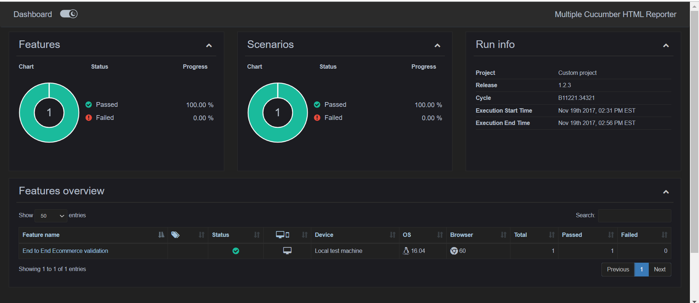

# Cypress Automation E2E 

## Description
This project is a robust End-to-End (E2E) test automation framework built using Cypress, designed to ensure the reliability and efficiency of web applications. The framework leverages the following technologies and methodologies:

Mocha-Chai for assertion-based testing.
BDD (Behavior-Driven Development) with Cucumber and Gherkin for writing human-readable test cases.
Page Object Model (POM) to enhance test maintainability and scalability.
The framework also integrates CI/CD pipelines using Jenkins and GitHub Actions, enabling seamless automation of test execution, reporting, and deployment workflows. Detailed test reports are generated and uploaded, along with screenshots of the results for easy debugging and analysis.

Key highlights include:

Structured and modular codebase for scalable test automation.
Real-time test execution reports (e.g., HTML reports) generated and stored for review.
Automated screenshots on test failures uploaded to GitHub for transparency.
This project is ideal for teams looking to streamline their testing processes and ensure consistent quality in software development.

## Table of Contents
- [npm i](#installation)
- [npx cypress open](#usage)

## Installation
1. Clone the repository:
   ```bash
  git@github.com:vpatil04/CypressAutomationE2E.git

## Screenshots
Below is an example of a test execution report:


